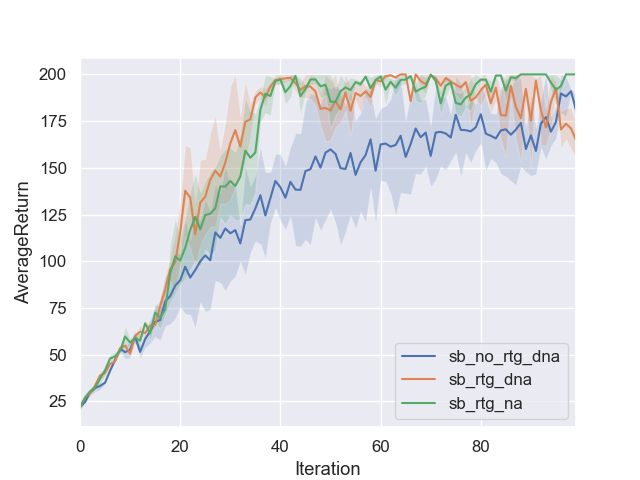
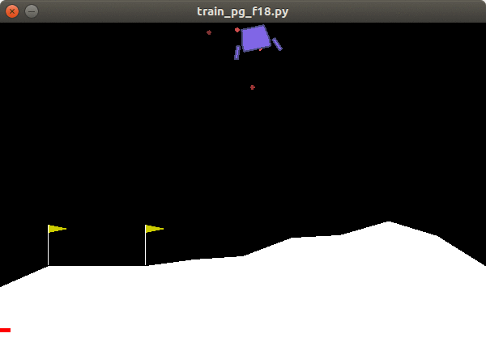

# CS294-112 HW 2: Policy Gradient

## Experiment

### EXP1: CartPole-v0: small_batch vs large_batch

### EXP2: InvertedPendulum-v2: find smallest batch size and largest learning rate

### EXP3: LunarLanderContinuous-v2(月球着陆器，很有意思的小游戏): debug nn_baseline

### EXP4: HalfCheetah-v2: search suitable batch_size and learning rate; benefit of reward to go and nn_baseline

### Bonus
 * 多线程收集数据
 * GAE-\lambda
 * 重复利用数据，实现多步训练；和单步训练对比

---
## 我的理解

主体上，观察世界得到输入，通过神经网络预测一个输出作为动作，这点和上一个作业（行为克隆）没什么不同；
不同的是行为克隆直接拟合专家的动作（监督学习），而策略梯度没有这么强的监督信息， 只能根据奖励来反推动作是否正确。
事实上根据奖励也无法反推出正确的动作，只能反推出更好的动作调整方向（梯度）而已。

依环境的不同，动作分为离散的和连续的:

    和分类任务类似，离散的动作表示为一组概率分布，测试的时候概率最大的那个动作输出；
    和回归任务类似，连续的动作为一组数值，测试时这组数值直接输出；

训练的时候动作输出不一样，动作要有随机性才能探索更多的可能:

    离散情况是按预测概率做伯努利实验，随机选择一个动作；
    连续时是为每个预测的值添加高斯噪声，使得这个动作有了概率的属性，概率服从多元正态分布;

所以训练时每个动作都有了对应的概率(所谓极大似然)；每个动作也有对应的Q值（评判动作好坏的标准）。

如果Q值很大，那么理应加大这个动作的概率，反之应该抑制；要实现这个目标只需将它俩相乘即可:

    最大化 target = Q * p 等效于最小化 -target，即 loss

* 关于轨迹(path, trajectory)：一连串动作就是轨迹，包括每个动作对应的状态、奖励；即游戏开始到游戏结束的所有数据，如果设定了步长那么游戏可以提前结束。

* 关于Q值：评判动作好坏。每个动作都有奖励，但是动作对后续的奖励也有影响，所以:
        no reward to go: 一条轨迹的所有奖励加权之和作为Q值，该轨迹上每个动作的Q值都一样(明显不合理)；
        reward to go: 该动作及之后所有动作的奖励加权之和作为该动作的Q值

* 关于nn_baseline：心理预期，理解为回报大于预期就会受到鼓励，回报小于预期就变得消极；

* 关于normalize：normalize之后Q值有正有负，避免全是正数或负数的情况，这样对决策既有抑制也有加强（不过好像提升效果不太明显）；
另外可能是类似batch_normalization的效果。

----
Dependencies:
 * Python **3.5**
 * Numpy version **1.14.5**
 * TensorFlow version **1.10.5**
 * MuJoCo version **1.50** and mujoco-py **1.50.1.56**
 * OpenAI Gym version **0.10.5**
 * seaborn
 * Box2D==**2.3.2**

Before doing anything, first replace `gym/envs/box2d/lunar_lander.py` with the provided `lunar_lander.py` file.

The only file that you need to look at is `train_pg_f18.py`, which you will implement.

See the [HW2 PDF](http://rail.eecs.berkeley.edu/deeprlcourse/static/homeworks/hw2.pdf) for further instructions.
