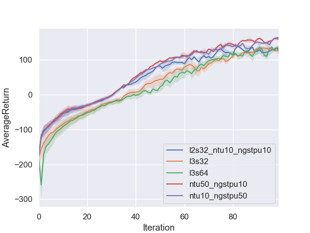
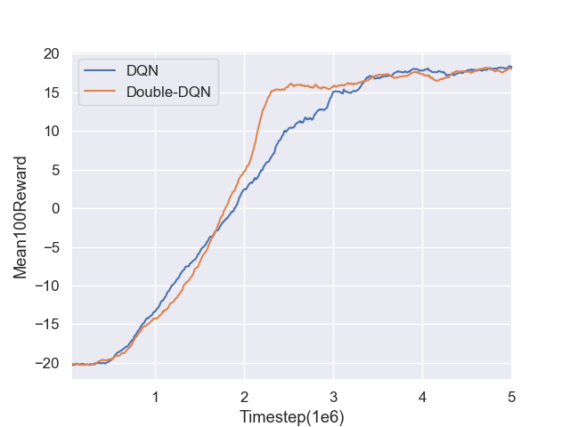
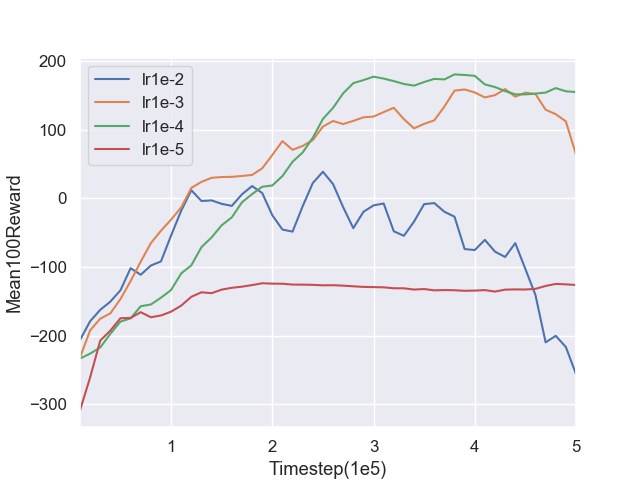

## actor-critic
这个方法是前面策略梯度的改进，前面提到用reward-to-go来统计reward作为q值，这里希望用一个critic网络来学习q。

### critic
`critic`输入observation，输出预测单个q值，这里q值的含义好像不一样了，我理解是代表对今后奖励的期望（不再像之前一样是具体路径的真实奖励，而是被今后各种可能路径的奖励给平均了，从下面策略来看就像是所有可能的action对应的q的平均值）；

###### 如果游戏结束了，那critic的预测的q是无效的，应当看做0。

对当前的observation有好几种q，下面从1到3，路径越来越明确，q越来越具体：

    1，critic直接预测当前observation；
    2，进行一个action，得到一个reward，reward+下一个observation的critic预测；
    3，reward-to-go；

上述2的q比1更具体，所以1的q为predict，用2的q作为ground-truth拟合（感觉有点问题）。
`critic`的loss用l2，或smooth-l1。

### actor
上述2的q减1的q叫做advantage：`adv = q' - q`，作为`actor`动作好坏的评判标准。

advantage和reward近似却不一样：

    reward是短视的，只关注当前得分；advantage是和整体得分关联的。

`actor`和策略梯度几乎是一样的，loss和之前也类似：`loss = -(prob * adv)`

训练过程：

    收集path；
    训练critic；
    用critic处理path得到adv_n；
    训练actor;
    循环。。。

### Q2.1 Sanity check with Cartpole

  

### Q2.2 Run actor-critic with (HalfCheetah-v2, InvertedPendulum-v2)

## DQN
### Q-learning
Q-learning假设有一个超大的表格，表格行是observation，列是action，数值是observation和action对应的q值。随着对环境的探索越来越多，表格也会越来越大，无穷大。然后测试时假如碰到了同样的状态后就选择q值比较大的action就是最优的路径了。

在探索（explore）中一开始完全使用随机action，后来表格丰富后则大概率选择q值大的action，小概率用随机action。

### Deep Q Network
DQN就是用深度神经网络（q网络）来代替表格，网络输入observation，输出多个q值，分别对应每个action。

    表格可能无穷大，神经网络的大小总是有限的；
    对于从未探索过的observation来说，表格无法提供策略，但是神经网络始终有q值输出；
    DQN和actor-critic的critic很像，不过critic输出一个q，DQN输出n_actions个q。

数据：

    训练神经网络需要收集数据，这些数据其实也是上述表格，但大小有限；
    要大批量训练数据才有好的效果，所以要先随机收集一波数据，然后训练；
    然后又收集一小波新的（训练后可以探索新的环境）和原来的混合一起训练。。。一直反复；
    这样就需要一个数据池，每次有放回的取数据，还要时常添加更新；

训练：

    这里的q值的监督学习也不用reward-to-go，而是和上面actor-critic的critic类似：reward + next_q;
    这里next_q用另一个q网络来获得，称为target network，这个q网络只是原q网络的一个备份，更新比较慢而已，因为这个q网络是用于得到监督学习的target的，作为靶子，更新太快对导致学习不稳定。
    因为输出q的数量有n_actions个，但实际只执行了一个action，所以也只用那个action对应q。

Double-DQN：

    前述，对于next_observation，用target network预测也会有n_actions个next_q;
    base-Q-learning 是取最大的next_q作为next_q，但是该方法会导致q始终被高估;
    double-Q-learning 是用原始q网络对next_obervation做一次额外的预测，对预测最大的q取对应的action，该action又对应到target network预测的q作为next_q，解决q被高估的问题;

### Q1.1 Q1.2 Base Q-learning, Double Q-learning in PongNoFrameskip-v4

  

这个游戏收集数据很慢，5M步要两天，一轮实验共四天了。

### Q1.3 experiment with learning rate in LunarLander-v2

  

------------

# CS294-112 HW 3: Q-Learning

Dependencies:
 * Python **3.5**
 * Numpy version **1.14.5**
 * TensorFlow version **1.10.5**
 * MuJoCo version **1.50** and mujoco-py **1.50.1.56**
 * OpenAI Gym version **0.10.5**
 * seaborn
 * Box2D==**2.3.2**
 * OpenCV
 * ffmpeg

Before doing anything, first replace `gym/envs/box2d/lunar_lander.py` with the provided `lunar_lander.py` file.

The only files that you need to look at are `dqn.py` and `train_ac_f18.py`, which you will implement.

See the [HW3 PDF](http://rail.eecs.berkeley.edu/deeprlcourse/static/homeworks/hw3.pdf) for further instructions.

The starter code was based on an implementation of Q-learning for Atari generously provided by Szymon Sidor from OpenAI.
