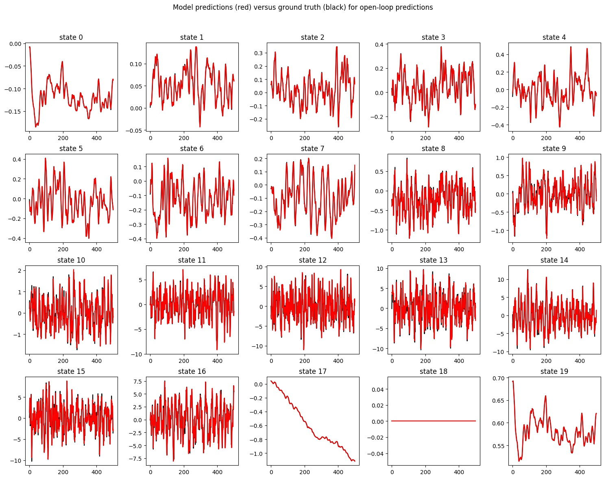
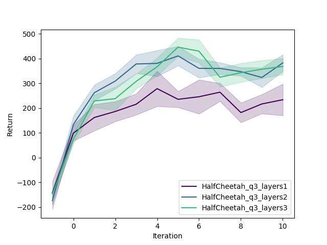
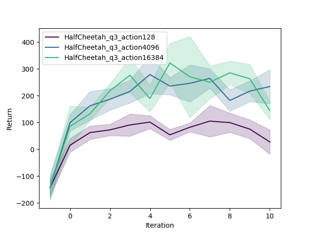
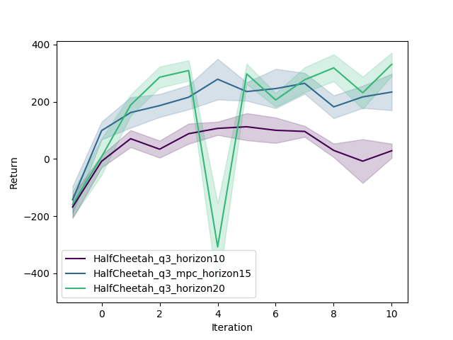

## Model-Based RL

### Model

基于模型的强化学习，该模型是指环境模型，
该模型输入当前observation和action，预测输出下一个observation和当前observation的差，
就能得到下一个observation了。

训练时要注意的是observation、action和observation的差都要归一化。

有了这个模型以后就相当于有了一个环境模拟器，可以用这个模型模拟成千上万次的动作轨迹。

### MPC(model predict control)

这些动作轨迹的深度有限，比如生成4096种随机动作，每种动作再接连随机生成15步`[15,4096,n_actions]`。
15叫做mpc_horizon，整个过程叫计划(plan，4096个未来15步的计划)。

在上述4096种轨迹都模拟运行一遍，找寻一个最好的，那么这个最好的第一个动作就是我们真实的动作了，这个过程叫做MPC。

### Cost Function

对于一个比如15步的轨迹，怎样评价有多好呢？其实还是累计每一步的cost
（类似reward，但是基于模型的模拟器没有reward，所以要自定义一个`cost_fn`）

`cost_fn`用来评价单步动作的好坏，不同的环境评价策略也不同，
这次作业的`HalfCheetah`环境是判断机器人两条腿和脖子的相对关系是否有利于跑步来评价的，
需要参数observation、action、next_observation。

### Train

先随机收集一大波数据，得到均值、方差，训练一个离线的model，这是Problem1；

执行MPC，将得到新的数据用于评价模型，这是Problem2；

执行MPC，得到新数据用于评价，同时加入到老数据里接着训练，
这和`hw1`目的一样，使数据分布一致，这是Problem3。

#### Problem 1

- learning rate: 1e-2
- nn_layers: 1
- `HalfCheetah`的动作空间是连续的

#### Problem 2

| Return          | ReturnAvg | ReturnMax | ReturnMin | ReturnStd |
|-----------------|-----------|-----------|-----------|-----------|
| Random policy   | -151.737  | -85.9306  | -234.441  | 41.4153   |
| Training policy | 106.774   | 183.864   | -11.7999  | 60.7897   |

#### Problem 3

